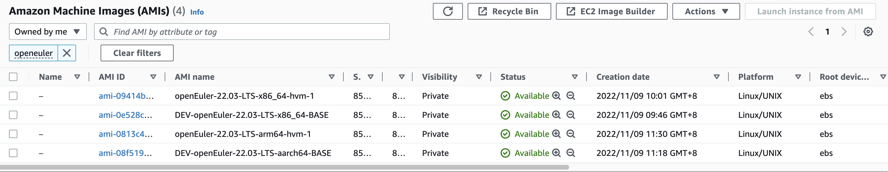

# Packer Build Scripts for openEuler

## Purpose

These scripts are used to create openEuler cloud image for AWS.

The generated AMI images can be found in `ap-northeast-1` (Tokyo) and `ca-central-1` (Canada) region.
You can edit the configuration files in [openeuler/aws/*.json](openeuler/aws/) to customize the region of the generated AMI images.

> AMI name begin with `DEV` is the "Base AMI Image" of openEuler, **this AMI image is not recommended to use in production**.
> AMI name without `DEV` is configured to install `cloud-init` and other packages, the installation script is [scripts/openeuler/packer/ami-install-cloud-init.sh](scripts/openeuler/packer/ami-install-cloud-init.sh)



## Usage

**Required OS**: Linux is required to run these scripts, MacOS and Windows are not supported since these scripts need to use `qemu-nbd` to load the partition in `qcow2` images onto system (for shrinking partition size) and `mount` the partitions (for install ENA kernel module).
The Linux distribution we use for developing this project is `Ubuntu 20.04 LTS`, other distributions are not tested yet and may not working properly.

This project use `make` command to run scripts, you can run `make` command without parameter to get more information.

```text
Usage:
    make ami        - Create 'AMI image' from the base AMI image by using packer
    make harvester  - Create harvester 'acow2 image' by using packer
    make clean      - Delete temporary files in 'tmp'
```

1. Install build dependencies.

    - Ensure `make`, `docker`, `awscli`, `jq`, `qemu-utils`, `partprobe` (`parted`), `packer` and `fdisk` are installed.
    - Make sure AWS config file `~/.aws/config` and `~/.aws/credentials` are configured, and the region should be set to `ap-northeast-1` (generated by command `aws configure`).
    - Make sure `AWS_ACCESS_KEY_ID` and `AWS_SECRET_ACCESS_KEY` environment variable are configured.

    Here is the example installation command for Ubuntu:

    ```sh
    # Ubuntu 20.04 LTS
    # Some packages may already installed before running this command
    sudo apt install make awscli jq qemu-utils parted fdisk
    ```

    <!-- Follow the [official installation guide](https://docs.docker.com/engine/install/ubuntu/) to install Docker. -->

    Following [this official installation guide](https://developer.hashicorp.com/packer/tutorials/docker-get-started/get-started-install-cli#installing-packer) to install the latest version of packer (version >= 1.7)

    Then run following commands to configure AWS Client.

    ```sh
    # Generate ~/.aws/credential
    aws configure
    # Set environment variables
    export AWS_ACCESS_KEY_ID=<key id>
    export AWS_SECRET_ACCESS_KEY=<secret>
    ```

    This project use `date +"%Y%m%d-%H%M"` for distinct the name of generated AMI images, **please make sure the time and timezone of your system is correct**.

    Create a AWS S3 bucket for uploading RAW images to create AWS snapshot, the name of the S3 bucket is required when runnning `make ami`.

    Clone this project:

    ```sh
    git clone https://github.com/cnrancher/euler-packer.git && cd euler-packer
    ```

2. Use packer to create AMI image: `make ami`

    `make ami` command involves following operations:

    - Firstly, upload the shrinked image to AWS S3 bucket and create 'Base AMI image', the name format of generated AMI image name is `DEV-*-BASE`
        > You can use `SKIP_BASE_AMI=1` to skip re-build base AMI image.
    - Use `packer` to launch an EC2 instance from "Base AMI image".
    - Install `cloud-init` and other useful tools, see [scripts/openeuler-install-cloudinit](scripts/openeuler-install-cloudinit).
    - Finally convert the EBS of the instance to AWS Snapshot, and generate AMI image from it.

    ``` sh
    OPENEULER_VERSION=<version> \
        OPENEULER_ARCH=<arch> \
        AWS_BUCKET_NAME=<bucket_name> \
        AWS_BASE_AMI_OWNER_ID=<ower_id> \
        make ami
    ```

    Environment variables when executin `make ami`:

      - `OPENEULER_VERSION`: openEuler version, default is `22.03-LTS`
      - `OPENEULER_ARCH`: openEuler arch, default is `x86_64`, can be `x86_64` or `aarch64`.
      - `AWS_BUCKET_NAME`: AWS S3 Bucket name, **required**
      <!-- - `AWS_BASE_AMI`: base AMI ID, required if not executed `make base-ami`
        This script can load base AMI ID from the output of command `make base-ami`, **so this parameter is not force required if you run `make base-ami` before `make ami`**. -->
      - `AWS_BASE_AMI_OWNER_ID`: The owner ID of the base AMI image, you can find this ID from AWS console panel, **this variable is force required**.

3. Finally packer will create an AMI image with its name format `openEuler-<VERSION>-<ARCH>-hvm-<DATETIME>`.

## Others

<!-- - If `make base-image` failed when trying to download/uncompress `qcow.xz` archive file, run `make clean` before re-run `make base-image`.

- If `make base-image` failed when resizing partition size, and `/dev/nbd0` is loaded on your system, run following command before re-run `make base-image`:

    ``` sh
    sudo qemu-nbd -d /dev/nbd0
    ```

- `make base-image` may fail when shirinking partition size, with error message `run 'e2fsck -f /dev/nbd0p2' first` or device is busy etc... Run following command and try to re-run `make base-image` again.

    ```sh
    # If the error message is about 'e2fsck', run:
    sudo e2fsck -f /dev/nbd0p2

    # If the error message is about 'device busy', run:
    sudo partprobe /dev/nbd0
    ```
-->

- Currently openEuler aarch64 does not have [ENA](https://github.com/amzn/amzn-drivers/tree/master/kernel/linux/ena) driver installed in kernel, this project use a workaround to download pre-build ENA kernel module and install into system when creating openEuler aarch64 RAW image.

    The ENA kernel module is installed in to `/opt/ena-driver/ena.ko`, and use `modprobe` to automatically load this kernel module when system start up. **Do not delete this file** or the EC2 instance won't connect to the internet!

- You can find the scripts to install docker at [scripts/others/install-docker.sh](scripts/others/install-docker.sh).

## License

Licensed under the Apache License, Version 2.0 (the "License");
you may not use this file except in compliance with the License.
You may obtain a copy of the License at

[http://www.apache.org/licenses/LICENSE-2.0](http://www.apache.org/licenses/LICENSE-2.0)

Unless required by applicable law or agreed to in writing, software
distributed under the License is distributed on an "AS IS" BASIS,
WITHOUT WARRANTIES OR CONDITIONS OF ANY KIND, either express or implied.
See the License for the specific language governing permissions and
limitations under the License.
