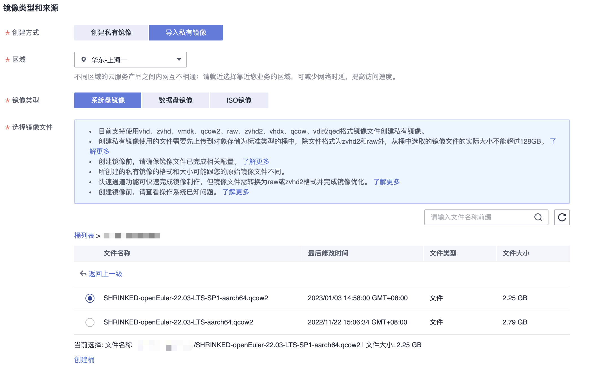
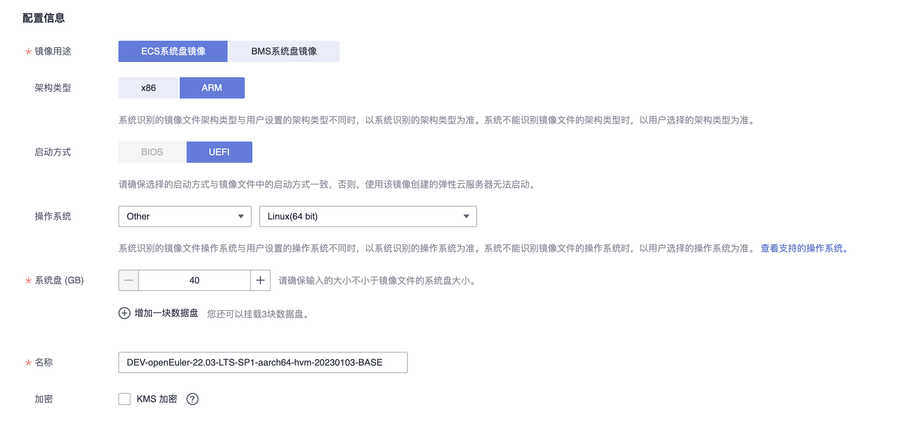

# openEuler Huawei Cloud

使用 `euler-packer` 项目的脚本为 [华为云](https://www.huaweicloud.com/intl/zh-cn/) 构建 openEuler 镜像。


本仓库的脚本会在 **华东-上海一** 区生成供鲲鹏 CPU 使用的 ARM64 架构的镜像。

可通过修改 [openeuler/hwcloud/](/openeuler/hwcloud/) 目录下的 Packer 配置文件指定镜像的生成区域。

## 构建流程

`euler-packer` 脚本构建 openEuler 华为云镜像的流程如下：

1. 构建本地基础镜像 (base-image)

    1. 下载 openEuler qcow2 格式的虚拟机镜像至本地。
    1. 使用 `qemu-nbd` 将 qcow2 格式的虚拟机镜像分区加载至系统，将总大小为 40G 的磁盘分区调整为 8G。

1. 构建基础云镜像 (base-hwcloud)

    1. 使用 `obsutil` 将缩容后的镜像上传至华为云 OBS 存储桶。
    1. 使用 *IMS 镜像服务* 将存储桶中存储的 qcow2 镜像制作基础云镜像。

1. 使用 Packer 构建云镜像

    1. 使用 Packer 启动 “基础云镜像” 虚拟机实例。
    1. 在虚拟机中安装 `cloud-init` 等基础软件包，调整内核参数，删除 root 密码等。
    1. 最终将此虚拟机的磁盘制作最终可供使用的云镜像 (`openEuler-<VERSION>-<ARCH>-hvm-<DATETIME>`)。

## 准备工作

1. Linux 系统

    在构建镜像的过程中，需要使用 `qemu-nbd` 将 qcow2 格式的镜像的分区表加载至系统中，之后对根分区进行缩容和分区表调整，因此 `euler-packer` 的脚本仅支持在 Linux 系统上运行。

    > 本仓库的脚本使用系统 Debian 12

1. 安装依赖

    安装运行脚本所需的依赖：`docker`, `awscli`, `jq`, `qemu-utils`, `partprobe` (`parted`), `packer`, `fdisk`, `obsutil`

    ```sh
    # Ubuntu
    sudo apt install awscli jq qemu-utils parted fdisk util-linux
    ```

    请按照 [官方教程](https://developer.hashicorp.com/packer/tutorials/docker-get-started/get-started-install-cli#installing-packer) 安装 Packer。

    安装 huaweicloud packer 依赖。

    ```sh
    packer plugins install github.com/huaweicloud/huaweicloud
    ```

    安装 `obsutil` 的教程请参考 [OBS 简介](https://support.huaweicloud.com/utiltg-obs/obs_11_0001.html)。

1. 初始化 `obsutil`

    设定 `obsutil` 的默认 endpoint 为 `ap-southeast-1` (华东-上海一区)。

    ```sh
    obsutil config -i=<AK> -k=<SK> -e=obs.ap-southeast-1.myhuaweicloud.com
    ```

    可使用 `obsutil ls` 检查是否配置成功。

1. 设定华为云 AccessKey 环境变量：

    ```bash
    export HW_ACCESS_KEY=<AccessKey ID>
    export HW_SECRET_KEY=<AccessKey Secret>
    ```

1. 建立 [OBS 存储桶](https://support.huaweicloud.com/obs/index.html)，用于储存 qcow2 镜像。

1. 克隆此仓库代码

    ```sh
    git clone https://github.com/cnrancher/euler-packer.git && cd euler-packer
    ```

1. 其他

    构建镜像时，脚本会使用 `date +"%Y%m%d"` 获取时间为镜像命名，因此请确保运行此脚本的系统时间和时区设置正确。

## 构建华为云镜像

1. 构建 `qcow2` 格式的基础镜像并上传至华为云 OBS 存储桶。

    ```bash
    ./openeuler.sh \
        --hwcloud-base \
        --version 24.03-LTS-SP1 \
        --arch aarch64 \
        --obs-bucket <BUCKET_NAME>
    ```

    执行脚本的参数：
    - `--version`: openEuler 版本号（**必须**）
    - `--arch`: 系统架构，默认为 `aarch64`，目前仅支持 `aarch64` 架构
    - `--obs-bucket`: 华为云 OBS 存储桶名称

1. 手动在华为云 *IMS 镜像服务* 页面创建基础云镜像。

    

    为了保持统一，将基础云镜像的名称格式设定为：`DEV-openEuler-<VERSION>-<ARCH>-<DATETIME>-BASE`

    

1. 参照 [华为云文档 - 使用Packer创建私有镜像](https://support.huaweicloud.com/bestpractice-ims/ims_bp_0031.html#section3) 设定下方参数，执行脚本，使用 Packer 构建华为云镜像。

    ```bash
    #!/bin/bash

    ./openeuler.sh \
        --hwcloud \
        --version 24.03-LTS-SP1 \
        --arch aarch64 \
        --vpc <VPC_ID> \
        --subnet <SUBNET_ID> \
        --source <BASE_IMAGE_ID>
    ```
----

最终构建的 AMI 镜像可于 *IMS 镜像服务* 页面获取到，命名格式为：`openEuler-<VERSION>-<ARCH>-<DATETIME>`

## 其他

openEuler 一键安装高版本 Docker 脚本 [scripts/others/install-docker.sh](/scripts/others/install-docker.sh)。
