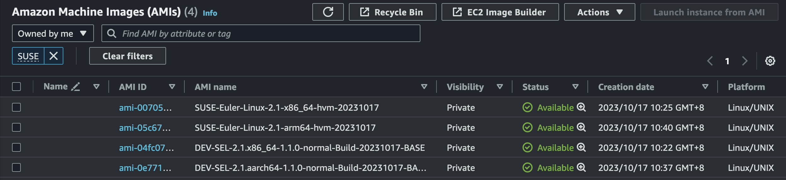

# SUSE Euler Linux AWS

使用 `euler-packer` 脚本为 [AWS](https://aws.amazon.com/) 构建 SUSE Euler Linux [AMI](https://docs.aws.amazon.com/AWSEC2/latest/UserGuide/AMIs.html) 镜像。

默认会在 AWS `ap-northeast-1` (Tokyo) 区域生成 AMI 镜像，可通过修改 [suseeuler/aws/](/suseeuler/aws/) 目录下的 Packer 配置文件指定 AMI 的生成区域。



## 构建流程

构建流程与 [openEuler AWS 镜像构建流程](./openeuler-aws.md#构建流程) 一致。

## 准备工作

1. Linux 系统

    在构建镜像的过程中，需要使用 `qemu-nbd` 将 qcow2 格式的镜像的分区表加载至系统中，之后对根分区进行缩容和分区表调整，因此 `euler-packer` 的脚本仅支持在 Linux 系统上运行。

    > 本仓库脚本使用系统 Debian 12

1. 安装依赖

    安装运行脚本所需的依赖：`docker`, `awscli`, `jq`, `qemu-utils`, `partprobe` (`parted`), `packer`, `fdisk`

    ```sh
    # Ubuntu / Debian
    sudo apt install awscli jq qemu-utils parted fdisk util-linux
    ```

    本仓库的脚本所使用的 Packer 版本需要大于等于 1.7，请按照 [官方教程](https://developer.hashicorp.com/packer/tutorials/docker-get-started/get-started-install-cli#installing-packer) 安装 Packer。

1. 初始化 `awscli` 并配置环境变量

    - 执行 `aws configure`，填写 Access Key ID，Secret Key 并将区域设定为 `ap-northeast-1`。
    - 设定环境变量 `AWS_ACCESS_KEY_ID`，`AWS_SECRET_ACCESS_KEY`。

    ```sh
    # Generate ~/.aws/credential
    aws configure
    # Set environment variables
    export AWS_ACCESS_KEY_ID=<access_key_id>
    export AWS_SECRET_ACCESS_KEY=<secret>
    ```

1. 建立 [AWS S3 存储桶](https://docs.aws.amazon.com/AmazonS3/latest/userguide/Welcome.html)

    在构建镜像的过程中会将 RAW 格式的 SUSE Euler 镜像上传至此存储桶中，之后为存储桶中的 RAW 镜像创建 Snapshot。

1. 克隆此仓库代码

    ```sh
    git clone https://github.com/cnrancher/euler-packer.git && cd euler-packer
    ```

1. 其他

    构建镜像时，脚本会使用 `date +"%Y%m%d"` 获取时间为 AMI 镜像命名，因此请确保运行此脚本的系统时间和时区设置正确。

## 构建 AMI 镜像

```bash
./suseeuler.sh \
    --aws \
    --aws-bucket <BUCKET_NAME>
    --aws-owner-id <OWNER_ID> \
    --version "2.1" \
    --arch "x86_64" \
```

执行脚本的参数：

- `--aws-bucket`: AWS S3 存储桶名称（**必须**）
- `--aws-owner-id`: AWS 帐号的 Owner ID，当前帐号的 Owner ID 可从 AWS 控制台获取（**必须**）
- `--version`: SUSE Euler Linux 版本号（**必须**）
- `--arch`: 系统架构，默认为 `x86_64`，可设定为 `x86_64` 或 `aarch64`
- `--mirror`: 下载 SUSE Euler Linux qcow2 镜像的镜像源链接，默认为 `https://repo.suseeuler.net`

----

最终构建的 AMI 镜像的命名格式为 `SUSE-Euler-Linux-<VERSION>-<ARCH>-hvm-<DATETIME>`。
